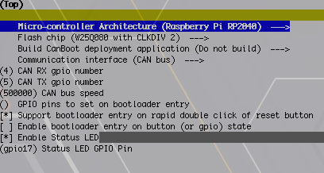
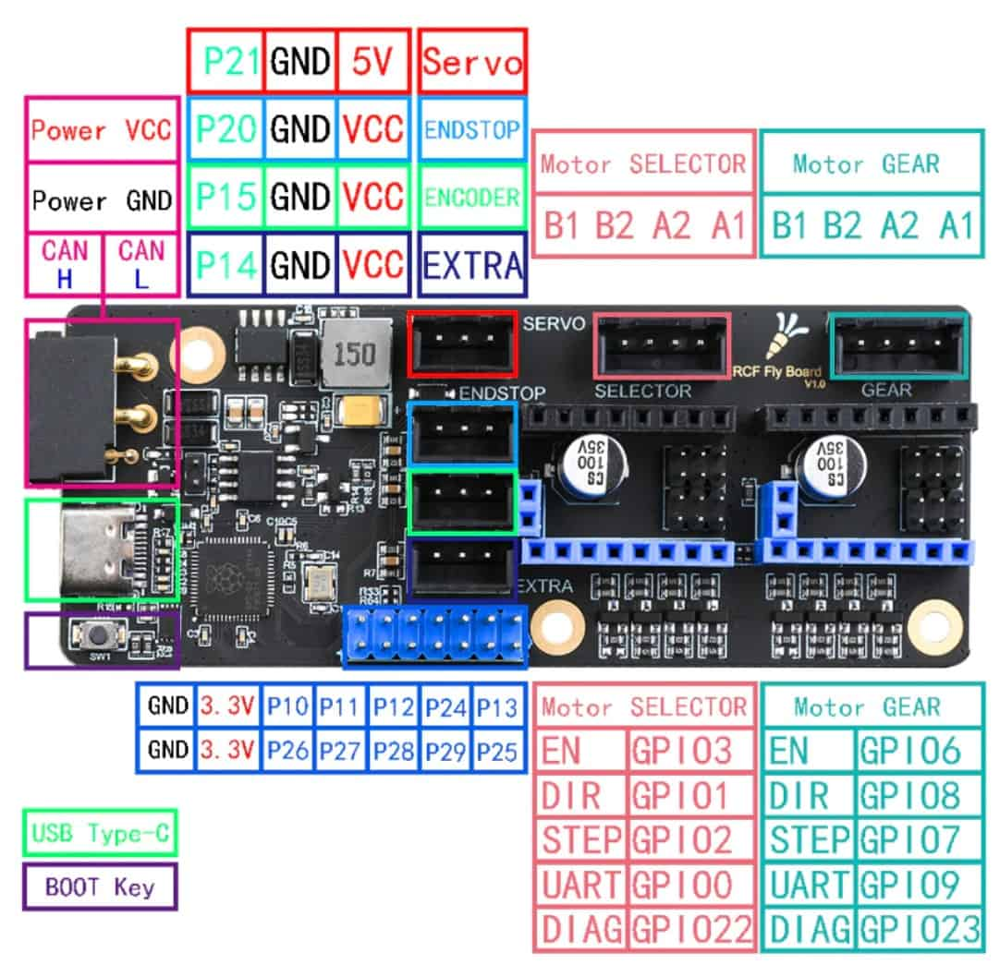

# Mellow EasyBRD CAN v1.1
Mellow EasyBRD CAN - CANBus Klipper and Canboot Firmware Configuration

| Function | PIN |
| --- | --- |
| CANBus | RX 4/ TX 5 |
| LED | gpio17 |

# Canboot



## Flash Command

````
make flash FLASH_DEVICE=<id>
````

# Klipper

## Flash Command

![Mellow EasyBRD CAN v1.1 Klipper (klipper-mellow_easybrd_v1.1)

# Pinout


