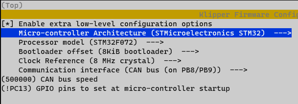
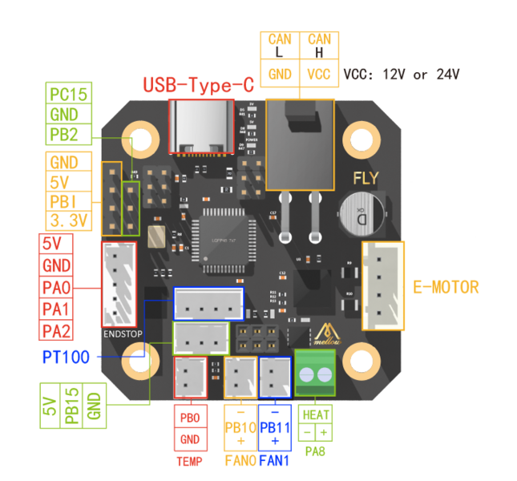

# Mellow FLY SHT42
Mellow FLY SHT42 - CANBus Klipper and Canboot Firmware Configuration

| Function | PIN |
| --- | --- |
| CANBus | PB8/PB9 |
| LED | PC13 |

# Canboot



## Flash Command

````
make flash FLASH_DEVICE=<id>
````

# Klipper

## Flash Command

# Pinout


