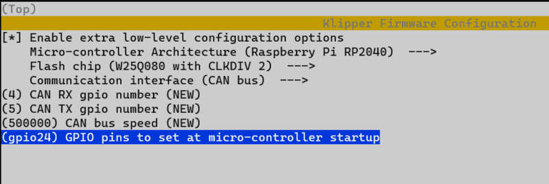

# Mellow SB2040
Mellow SB2040 - CANBus Klipper and Canboot Firmware Configuration

| Function | PIN |
| --- | --- |
| LED | gpio24 |

# Canboot



## Flash Command

````
make flash FLASH_DEVICE=<id>
````

# Klipper

