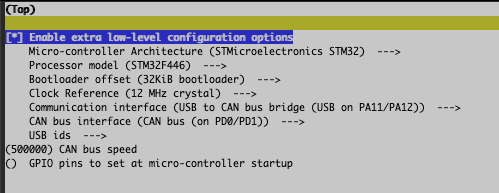

# BTT Octopus v1.1 Pro -
BIGTREETECH Octopus v1.1 Pro - CANBus Klipper and Canboot Firmware Configuration

| Function | PIN |
| --- | --- |
| LED | PA13 |

# Canboot


## Flash Command

````
sudo dfu-util -a 0 -D out/canboot.bin --dfuse-address 0x08000000:force:mass-erase:leave -d 0483:df11
````

# Klipper



````
python3 flash_can.py -f ~/klipper/out/klipper.bin -d /dev/serial/by-id/usb-<serial id>
````